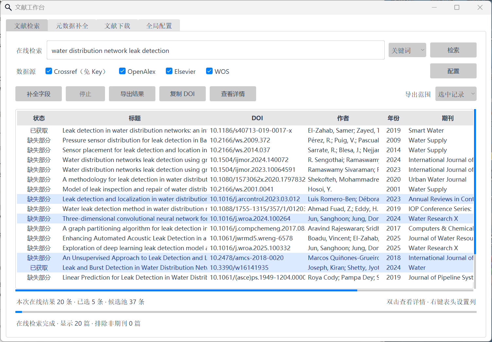
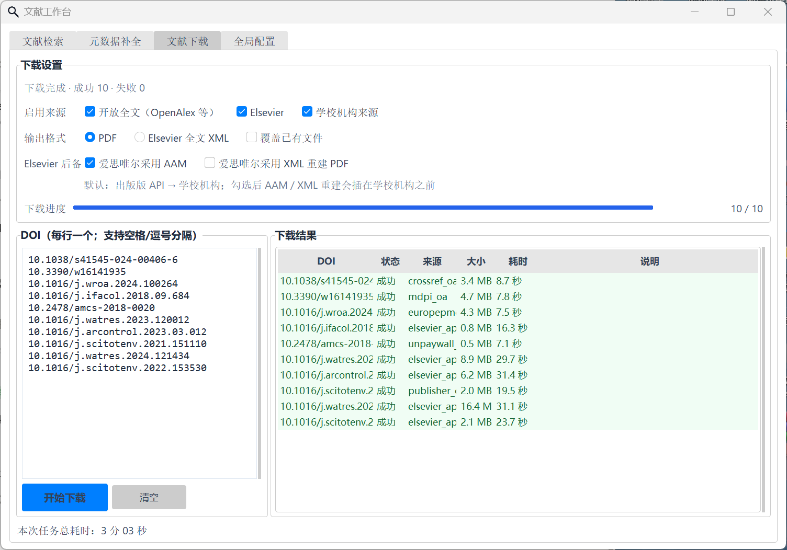

# Literature Suite · 文献工作台

检索文献、补全元数据、下载全文、导出到 Zotero，一个入口全部完成。

- **双击就是 GUI**：四个页面（文献检索 / 元数据补全 / 文献下载 / 全局配置）共用一份配置。
- **带参数就是 CLI**：所有命令输出稳定 JSON，可以直接交给 Codex、Claude Code 等 AI Agent 调用。
- **只走合法来源**：开放获取全文、出版社官方 API，以及你本人所在学校已经购买的机构订阅。

> A desktop + CLI toolkit for literature search, metadata completion, legal full-text download
> (open access, publisher APIs, your own institutional subscription) and RIS export to Zotero.
> The interface and docs are in Chinese.



## 功能

### 1. 文献检索

- 数据源：Crossref（免 Key）、OpenAlex；按 **自动识别 / 标题 / 关键词 / DOI** 检索。
- 多源结果按 DOI 合并去重，自动排除非期刊条目。
- **种子文献拓展**：选中一篇或多篇种子文献，一跳查找它的参考文献和施引文献。
- 选中结果后可以直接右键“发送到元数据补全”或“发送到文献下载”，也可以导出 JSON / CSV / RIS。

### 2. 元数据补全

- 从 Crossref、OpenAlex、Elsevier、Web of Science 查询（Elsevier 的文章优先使用官方数据），补全作者、期刊全称与缩写、年份、出版日期、卷、期、页码、文章号、ISSN、语言、出版社、摘要等 14 个字段。
- **已有字段不覆盖**，每个字段都会记录来源，方便核对。
- 本地文献库（SQLite）可扫描 PDF 目录，按 DOI 自动关联本地 PDF。
- 一键导出 RIS，Zotero、EndNote、NoteExpress 等都能直接导入。

### 3. 文献下载

按顺序级联，任何一级成功就立即停止：

1. **开放全文**：OpenAlex、Unpaywall、Crossref 声明的 OA 位置、Europe PMC、出版社落地页，MDPI 主站限流时回退到官方资源 CDN。
2. **Elsevier 官方 API**：出版版 PDF →（可选）作者接受稿 AAM →（可选）全文 XML 重建 PDF。
3. **学校机构订阅**：校园网直连，或 WebVPN / EZProxy / EasyConnect / aTrust，内置 144 所学校的公开接入参数。
   - **ScienceDirect 回退路径**：参考 [ScanSciPDF](https://github.com/Rimagination/scansci-pdf) 的思路，当 `/pdfft` 返回 JavaScript 挑战页时，在程序独立的浏览器配置中打开机构代理后的文章页，点击文章自己的“View PDF”，只接收浏览器实际收到的 PDF 响应；需要人机验证时由你本人完成。
   - WebVPN 没取到 PDF 时，会自动再用校园网直连尝试一次。

每个结果都会校验 PDF 文件头和页面结构，登录页、验证码页、只有一页的权限预览都不会被当成成功。



### 4. 全局配置

PDF 目录、检索上限、联系邮箱、各类 API Key、机构接入方式都在这里设置。Key 默认以 `*` 隐藏，保存到程序目录的 `config.local.json`（已被 `.gitignore` 忽略）。

## 快速开始

需要 Windows + Python 3.10 及以上（Tkinter 随官方 Python 安装包提供）。机构浏览器回退和 XML 重建需要本机安装 Chrome 或 Edge。

```bash
git clone https://github.com/bvb6417/literature-suite.git
cd literature-suite
python -m pip install -r requirements.txt
python literature_suite.py
```

不带参数运行即打开 GUI。第一次使用不填任何 Key 也能检索和下载开放全文；需要更多来源时，在“全局配置”页填写，或复制 `config.example.json` 为 `config.local.json` 后修改。

| 配置项 | 作用 | 是否必需 |
| --- | --- | --- |
| `contact_email` | Crossref / OpenAlex 礼貌池，请求更稳定 | 建议填写 |
| `api_keys.openalex` | 启用 OpenAlex 检索与补全 | 可选 |
| `api_keys.elsevier` | Elsevier 元数据与官方全文 API，[申请地址](https://dev.elsevier.com/) | 可选 |
| `api_keys.elsevier_inst_token` | 学校申请的 Elsevier InstToken，校外使用 API | 可选 |
| `api_keys.wos` | Web of Science Starter API，补全元数据 | 可选 |
| `api_keys.crossref` | Crossref Metadata Plus | 可选 |

> 有 Elsevier API Key 不等于拥有全文权限。能否拿到闭源全文，仍取决于学校是否订阅了对应期刊和年份，以及请求是否来自授权的机构出口。

## 命令行

所有子命令都向 stdout 输出 JSON；退出码 `0` 表示全部成功，非 `0` 表示有失败或出错，具体看 JSON 中的 `ok` 和逐条结果。

```bash
# 关键词 / 标题 / DOI 检索
python literature_suite.py keyword "water distribution network leak detection" --limit 20
python literature_suite.py search "Leak detection in water distribution networks" --mode title
python literature_suite.py doi 10.3390/w16141935

# 种子文献一跳拓展（参考文献 + 施引文献）
python literature_suite.py expand 10.1016/j.arcontrol.2023.03.012 --direction both --limit 30

# 补全元数据并导出 RIS（也支持 .json / .csv）
python literature_suite.py enrich 10.3390/w16141935 10.1016/j.watres.2023.120012 -o refs.ris
python literature_suite.py enrich --input records.json -o refs.ris

# 下载全文；--json-lines 逐篇输出事件，适合长批次
python literature_suite.py download 10.3390/w16141935 10.1016/j.watres.2023.120012 --sources openalex,elsevier,webvpn
python literature_suite.py download --help

# 检查各渠道配置状态（输出已脱敏）
python literature_suite.py check
```

`download` 的 `--sources` 中，`webvpn` 指“全局配置里选中的机构接入方式”，不一定是 WebVPN。

## 给 AI Agent 调用

CLI 不需要交互，输出是结构化 JSON，可以直接写进 Agent 的指令里，例如：

```text
文献工具位于 <path>/literature_suite.py，用 python 调用，所有输出都是 JSON：
- 检索：python literature_suite.py keyword "<关键词>" --limit 20
- 拓展：python literature_suite.py expand <DOI...> --direction both
- 补全并导出：python literature_suite.py enrich <DOI...> -o refs.ris
- 下载：python literature_suite.py download <DOI...> --json-lines
只使用开放获取、官方 API 和本人学校订阅；遇到登录或人机验证时停下来交给我处理。
```

仓库里的 [`skills/literature-suite/SKILL.md`](skills/literature-suite/SKILL.md) 是一份现成的 Skill，复制到 Claude Code 或 Codex 的 skills 目录、把路径改成你的安装位置即可。

## 导入 Zotero

1. 在“元数据补全”页选中文献，点击 **导出 RIS**；或用 CLI `enrich ... -o refs.ris`。
2. Zotero 中选择 **文件 → 导入**，选中 RIS 文件。
3. 已下载的 PDF 可以拖到对应条目上作为附件。

## 数据保存在哪里

程序写入的所有内容都在 `literature_suite.py` 同目录，不会写到系统盘的用户目录：

| 路径 | 内容 |
| --- | --- |
| `config.local.json` | 本机配置与 API Key |
| `downloads/` | 默认 PDF 目录 |
| `metadata_library.sqlite3` | 元数据补全页的本地文献库 |
| `state/` | 各学校登录 Cookie、MDPI 期刊缓存 |
| `browser-data/` | 机构登录与 ScienceDirect 回退使用的独立浏览器配置 |
| `.tmp/` | 运行时临时文件 |

以上都已写入 `.gitignore`。程序只保存会话 Cookie，不读取、不保存学校账号密码。

## 目录结构

```text
literature-suite/
├── literature_suite.py        # 入口：无参数打开 GUI，带子命令调用 CLI
├── config.example.json        # 无密钥配置模板
├── requirements.txt
├── src/
│   ├── suite_gui.py           # 统一 GUI（四个页面）
│   ├── suite_cli.py           # 统一 CLI
│   ├── suite_search.py        # 在线检索与元数据合并
│   ├── suite_search_ui.py     # 文献检索页
│   ├── suite_expansion.py     # 种子文献拓展
│   ├── paper_metadata_*.py    # 元数据补全页与本地文献库
│   ├── literature_download_*.py  # 下载内核与下载页
│   ├── providers/             # Elsevier、MDPI、机构接入、浏览器 CDP 等适配器
│   ├── schools.json           # 学校公开接入参数
│   └── themes/azure/          # Azure ttk 主题
├── skills/literature-suite/SKILL.md
├── docs/images/
└── third_party_licenses/
```

## 使用边界

本项目不接入 Sci-Hub、镜像站或共享账号，也不绕过任何付费墙。它只整合：

- 明确开放获取的全文；
- 出版社官方 API；
- 你本人所在学校已经购买的机构订阅；
- 你在可见浏览器中主动完成的学校登录和人机验证。

学校没有订阅的期刊或年份，程序同样拿不到。请遵守学校、出版社和当地法律法规的授权范围，不要用高并发给学校出口和出版社服务器增加压力。

## 致谢与许可证

本项目的主要代码由作者与 [OpenAI Codex](https://openai.com/codex/)（GPT）协作开发，开源整理、文档与测试由 [Claude Code](https://claude.com/claude-code) 协助完成。

- [ScanSciPDF](https://github.com/Rimagination/scansci-pdf)（Apache-2.0）：学校接入参数来源，以及 ScienceDirect 机构回退思路的参考。
- [Azure ttk theme](https://github.com/rdbende/Azure-ttk-theme)（MIT）：界面主题。

详见 [THIRD_PARTY_NOTICES.md](THIRD_PARTY_NOTICES.md)。本项目以 [Apache License 2.0](LICENSE) 发布。
